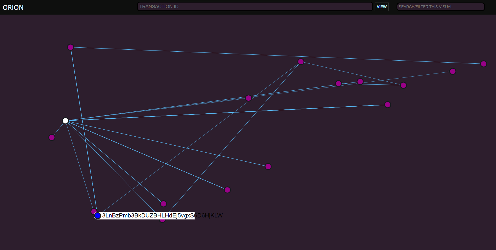

# ORION

## Transaction Visualizer

A serverless tool to visualize the path of bitcoin transaction and outputs. This is demo software powered by mempool.space API and sigma.js charting library. 

Run `orion.html` located in the `public` directory to visualize a single transaction and nearest relations.

Run `link.html` located in the `public` directory to visualize and link multiple transactions using the memory add (M+) and memory remove (M-) buttons. Clicking (M+) will save the current transaction data to the clients local memory, and will be loaded up with all future transactions queried. You can use the (M+) button multiple times to expand the visualize. Clicking (M-) will remove the saved data from local memory.

Donations accepted (BIP352): sp1qqgyfdwfg3quxngctw4w7z0xh9hntfkf3tdzrts5cjgqxdvycnv05cqul76mhtrp3k497hqxxeh247qczuy624yw4s24tn5j2zsztdvyntuwq5jcz

This is free and unencumbered software released into the public domain.

Anyone is free to copy, modify, publish, use, compile, sell, or
distribute this software, either in source code form or as a compiled
binary, for any purpose, commercial or non-commercial, and by any
means.

In jurisdictions that recognize copyright laws, the author or authors
of this software dedicate any and all copyright interest in the
software to the public domain. We make this dedication for the benefit
of the public at large and to the detriment of our heirs and
successors. We intend this dedication to be an overt act of
relinquishment in perpetuity of all present and future rights to this
software under copyright law.

THE SOFTWARE IS PROVIDED "AS IS", WITHOUT WARRANTY OF ANY KIND,
EXPRESS OR IMPLIED, INCLUDING BUT NOT LIMITED TO THE WARRANTIES OF
MERCHANTABILITY, FITNESS FOR A PARTICULAR PURPOSE AND NONINFRINGEMENT.
IN NO EVENT SHALL THE AUTHORS BE LIABLE FOR ANY CLAIM, DAMAGES OR
OTHER LIABILITY, WHETHER IN AN ACTION OF CONTRACT, TORT OR OTHERWISE,
ARISING FROM, OUT OF OR IN CONNECTION WITH THE SOFTWARE OR THE USE OR
OTHER DEALINGS IN THE SOFTWARE.

For more information, please refer to <http://unlicense.org/>
